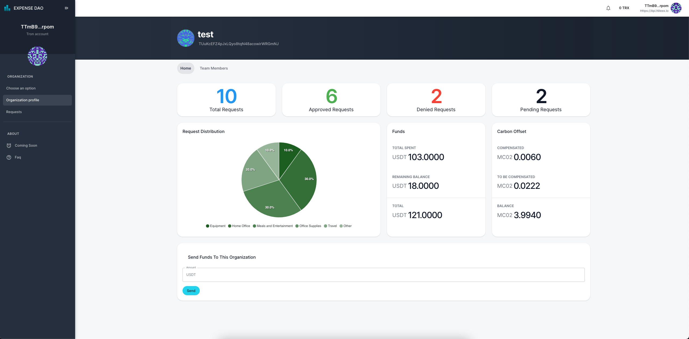

# ExpenseDAO

</img>

**This is a repo which contains only smart contract files and examples, screenshots, etc. For a full source code repo please contact us at golubovicaleksandarr@gmail.com**

## Project Overview
ExpenseDAO is an expense management system for DAOs (Decentralized Autonomous Organizations). The app tracks and files expenses such as fuel, travel, and meals.
Users need to create an organization, assign user roles, and start using ExpenseDAO!
Once users photograph receipts, the photos are uploaded and stored on a distributed storage using IPFS and Web3.Storage.
OCR identifies the amount of the transaction, then the user categorizes and saves the expense to the organization smart contract.
It also allows users to upload receipts from online purchases that can be submitted for reimbursement.
Once approved, the amount of the reimbursement request gets automatically sent from DAO's wallet to the user who created the request.
The payments are done in stable coins on the Celo network.

ExpenseDAO allows users to see all expense reports based on user transactions.
On organization creation, user roles have to be assigned.
Also, the default currency has to be set. Currently, cUSD and cEUR are supported.
Inside ExpenseDAO, a member of a DAO can be registered either as an **Approver**, which gives the power to approve or deny expenses,
or a **Member**, which represents a regular member who can create new reimbursement requests.

## How to use ExpenseDAO

Log in with your wallet. Please make sure that you've added Celo Alfajores network to your wallet.
The application is tested with Metamask and Valora (Alfajores) testnet wallets.
Once logged in, a user can either create a new organization, or open an existing one.
In the latter case, the user must be a member of a particular organization already.

### Create new organization
To create a new organization, you need to insert the organization name, which is unique across the whole system.
Then add organization members, both **approvers** and **members**. You can either insert these values manually,
or use two .csv files that contain the lists of members' addresses. One .csv file for Approvers, and another for Members.
For example, see the .csv files provided at /example_files/ directory.
Then choose the native currency for the organization. There are two stable token options at the moment - cUSD and cEUR.
And finally, click on "create new organization" button and confirm the transaction in your wallet.

### Enter the existing organization
Once logged in, choose "Enter existing organization" option, and type in the organization name.
If the organization with provided name exists, and your address is a part of that organization, you'll see a main dashboard page.
Otherwise, you'll see a proper message that describes the issue (probably misspelled name, an organization that you don't have access, etc.).
A main page shows all the details about the organization - a number of requests, organization balance, carbon token balance, spent tokens, requests category, etc.
Depending on your user role, there will be shown an additional features like sending funds to the organization, burning the carbon credit tokens, etc.

### Create reimbursement request
To create new reimbursment request, go to Requests page. This page shows a list of the existing requests.
Regular members can see only its requests, but Approvers will have a full list of requests for entire organization.
Click on "Create new request" button and fill in required information.
First, upload a receipt photo. The app runs on a smartphones too, so the user can take a photo of the receipt right from the app.
The amount on the receipt should be recognized by the app, but there is an option to enter in manually.
Then choose category and fill in the description.
In case of travel expenses, there will be an additional option to choose whether the expense report is eliglible for carbon offset.
If so, fill in the required information - milege and type of transport. The app will calculate how much CO2 emission has been created.
Then click "send" and confirm the transation.

### Approve/deny reimbursement request
An approver is allowed to approve/deny requests in the organization. Go to Requests page, and there will be a list of all the requests. Clicking on particular one, an approver can see the request details. Also, there are two buttons - "Approve" and "Deny".
Once the request has been approved, the requested amount will be sent to the member's wallet. All reimbursments are being paid from the organization's wallet.

### Carbon credits
On the main page, there is an option to send carbon credit tokens to the oganization's wallet.
Carbon credit tokens are used to compensate the CO2 emission made by organization members.
All travel expenses are suitable for carbon emission calculation.
When creating the travel expense request, the member has to fill in an additional details:
a type of transportation used, and travel mileage.
Then the app will calculate how much CO2 has been created during that trip.

There are following rules and constraints in order to make ExpenseDAO organization fair:
1. Organization names are unique. There won't be two organizations with the same name
2. There must be at least two **Approver** members
3. One wallet address can be added to either **Approver** or **Member** role
4. Both approvers and members are allowed to create a reimbursement request.
5. An approver cannot approve its own request. The other approvers are allowed to do it.
6. Only approver is allowed to do the carbon offsetting.
7. All the reimbursements are paid out from the organization's wallet.


## Deployed Contracts
**Tron Nile testnet**
Registry contract address: TDVhs8p4RuzndoKUYddwTju4neM2x6RQE9
co2 Token address: TAFyAwZraAqcfQoEDfU2sMzA6AsPp6DNtR
ExpenseDAO factory address: TA34rk621RTu1Ccm33if4moP9SdxgLteRB


## Technologies
* React
* Solidity

## Project developed with
* [TronWeb](https://developers.tron.network/docs/introduction)
* [Tron IDE](http://www.tronide.io/)
* [IPFS](https://ipfs.io/)
* [Web3.Storage](https://web3.storage/)

## Quick start

### Prerequisites
* [Node 12+](https://nodejs.org/en/download/)
* [Yarn](https://classic.yarnpkg.com/en/docs/install/)
* [TronLink wallet](https://www.tronlink.org/)

### Smart Contracts have been deployed to Tron Nile testnet
* Registry contract address: TDVhs8p4RuzndoKUYddwTju4neM2x6RQE9
* ExpenseDAO Factory contract address: TA34rk621RTu1Ccm33if4moP9SdxgLteRB
* (CO2 Credit) Test token address: TAFyAwZraAqcfQoEDfU2sMzA6AsPp6DNtR

### How to try the application
The live app has been deployed to https://expense-dao.vercel.app/login
Make sure that Nile testnet is configured in your TronLink wallet.

### How to build and run application
- Go to packages/ExpenseDAO/ and start frontend. Run the following:
```
    yarn install
    yarn start
```
- Open https://localhost:3000 to see the app

## Future work/TODO
* Improve receipts recognition
* Optimize the mobile UI
* Add support for other wallet applications
* Implement multisignature request approvals
* Optimize smart contracts
* ...


